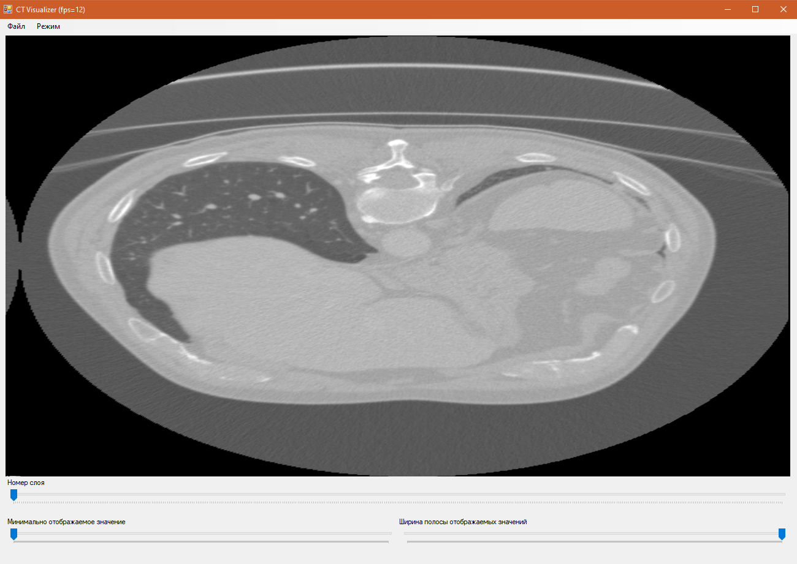
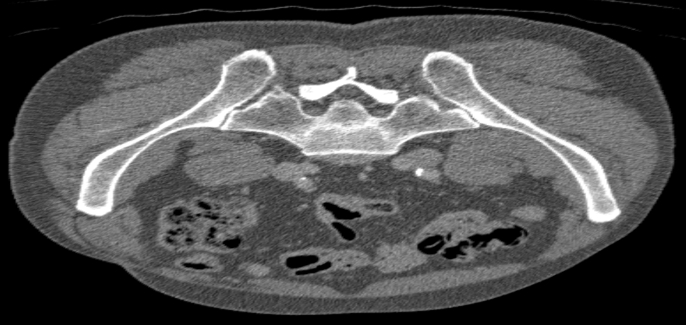
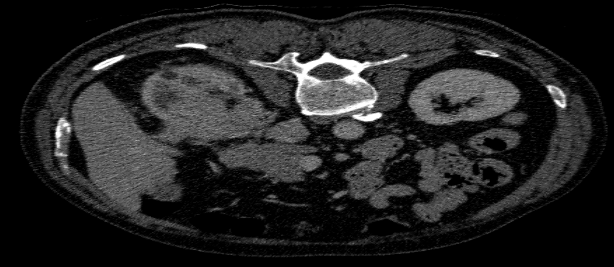
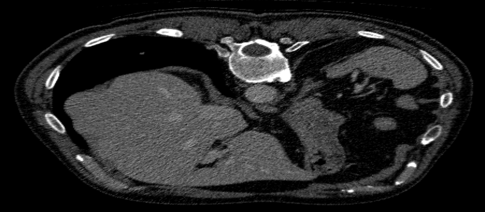
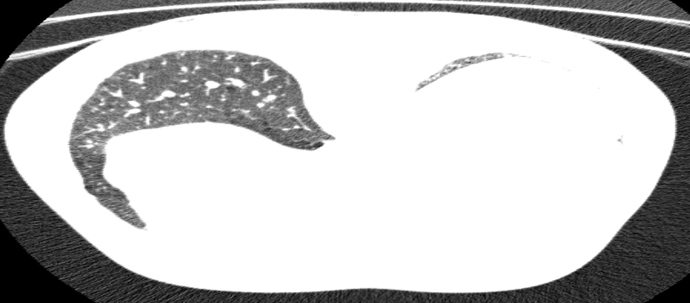

# CG_2

Рухович Игорь

381808-1

Отчёт по лабораторной работе №2. Визуализация томограмм.

Так выглядит окно приложения:

Верхний ползунок отвечает за номер отображаемого слоя томограммы. Слева самый верхний слой, справа - нижний.

Нижние ползунки регулируют диапазон отображаемых цветовых значений. Минимальное значение отображается в чёрный цвет, максимальное в белый. Данная томограмма содержит значения от 0 до 24399, но плотность их распределения после 3000 стремится к нулю. Поэтому было принято решение сделать максимально достижимое ползунками значение - 3000. Все значения больше этого будут отображаться белым цветом на томограмме. Минимальная ширина полосы значений ограничена 255, т. к. при меньшем значении теряется информативность рисунка.

Для удобной навигации по томограмме рекомендуется выставить минимальное значение так, чтобы исследуемый орган был едва виден (практически черным), а ширину полосы значений максимально уменьшить, чтобы была заметна разница между близкими элементами.

Таким образом можно достичь весьма неплохих отображений:

- Тазовая кость:
- Почки (темные круги слева и справа в верхней части):
- Нижняя часть сердца и прилегающие сосуды (справа в верхней части):
- Лёгкие (правое слева и кусочек левого справа; из-за наличия сердца левое лёгкое меньше):

Реализованы 3 режима отображения (одной текстурой, квадратами и лентами квадратов). Переключение осуществляется в меню "Режим".